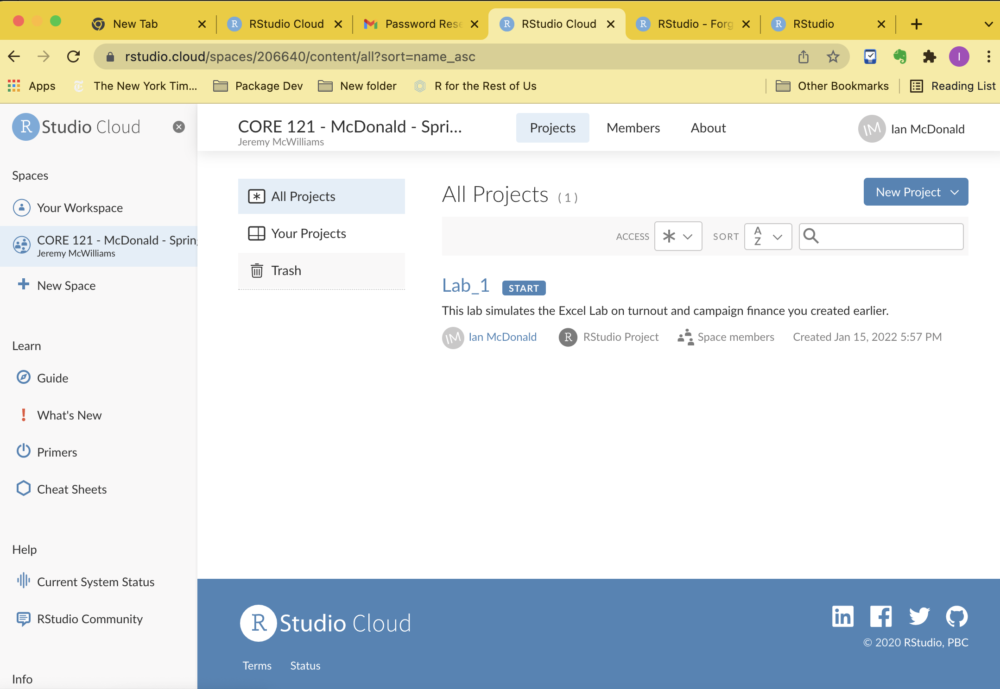
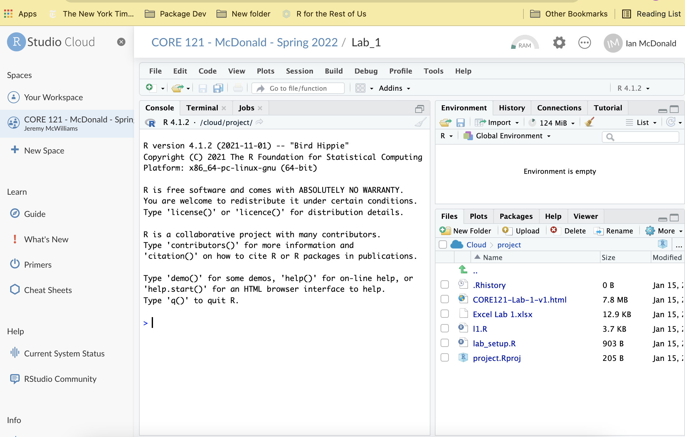
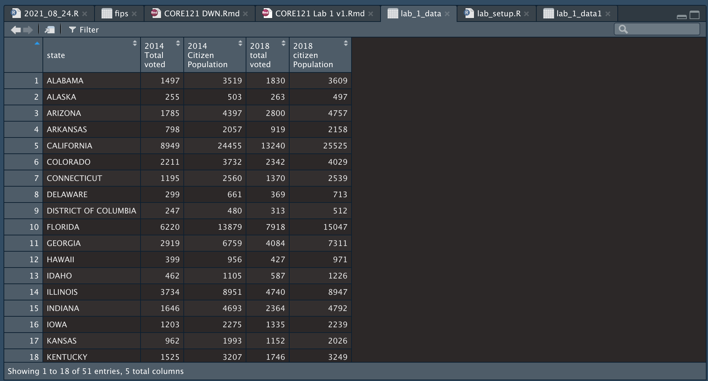

```{r setup, message = FALSE, echo=FALSE}
knitr::opts_chunk$set(echo = TRUE, include = TRUE, results = "hide", message = FALSE)
source("lab_setup.R")
```

## Overview

This starter exercise shows you how to manipulate and manage a basic dataset using the R programming environment. We will use the interactive tool RStudio to produce results with the core R language.  

This exercise will mimic the results you saw in Excel Lab \#1. All you will do is copy some R statements from this page into an R Script on the server. From there, you will execute the script and observe the results.  

Don't be concerned if you're unfamiliar with programming in general or R specifically, The purpose of using R in this exercise is to learn a few basic ideas about managing and calculating data in a two-dimensional data set.  

You will copy and paste the content from the gray boxes into a file you'll name lab1.R. You'll execute the file, note some results into lab1.R, download it, then submit it the Google Classroom.  

## R and RStudio

Note that R is a programming language that you will run with the RStudio application. RStudio is just one of many ways you can develop work with the R programming language, but it's the most popular, and like R it's openly sourced and completely free to anyone who wants to use it. For now, you only need to concern yourself with RStudio, and there is a good chance it will be the only way you ever interact with R.

Other Numbers classes are using a similar kind of language called Python. Like R, there are many tools that support work in Python. There are several popular Python development tools.

## Acceessing the Assignment in RStudio Cloud

In your browser, enter this URL:
https://bit.ly/35Zmixt

OR

You will receive an email invitation that looks like this:  

{width=40%}  

If you don't receive an invitation, check to make sure your account has the lc21-XXXX@lclark.edu format of your gmail account.  

You may be asked to log in (don't forget to use Google login).  You will see this display.  

{width=40%}    

Click on Lab_1, and after a few seconds, you will see the RStudio interface and you will be ready to start the lab.  

{width=40%}  

## Building the R Script

Before you start, create an empty script file with this menu sequence:

File - New File - R Script

and you will see an empty script in the upper left region of the window.  Save you file with the name Lab_1.

I'll give you a bit of explanation of the commands as you paste them and run them.

The first thing were going to do is load some special R content stored something called a **library**. The library contains programs and data that your script can retrieve later. R, like all programming languages, is extended beyond its very basic capability by the work of programmers from anywhere (including yourself, perhaps, someday).

As you go through the lab, the sequence for completing the script is:

**-   Copy the lines from EACH grey box into your R script, which you created in the upper left corner of your RStudio session.**

Your R script is an ordinary text file with a file type of "R".

**-   Place your mouse cursor into the script, select the lines you just pasted, and then click on the "Run" button with the green arrow in front of it. Sometimes you'll see things change on your screen.**

```{r include=TRUE}

library(readxl)
library(tigris)
library(sf)
library(tidyverse)
library(plotly)

source("lab_setup.R")

```
Start with these five lines.  Copy them, paste them into the R Source window, and save the file as *lab_1*. 

Repeat that process every time you see a gray box like this one.

```{r include=TRUE}
print("It's not your world, it's not my world, it's R world")
```

Notice that you store your commands in one window of your display, in the upper left corner. That window is called Source.

When you execute something, the immediate results appear in the bottom left window called the console. If you want, you can enter commands direct in the console at the ">" prompt. Once in a great while you may want to try that but the normal sequence is to enter content in the source, and when you want to run something, see the results in the console.

You should make sure you save your work every time you change something, or at the very least save it frequently.

Let's upload some more code. By the way, you can leave as many blank lines as you want in a script, and blank lines will help makes things more readable when placed artfully, just like anything else you write.

***
The line in this box will read the data from the first worksheet of your Excel file and create an R data table.

```{r Read Excel File, echo=TRUE, include=TRUE}
lab_1_data <- read_excel("Excel Lab 1.xlsx")
```

Notice in the upper right corner a new object appeared called *lab_1\_data*. Click on the blue arrow beside it, and you will see all the column names from the spreadsheet appear in a list.

In fact, click on the *lab_1\_data* name itself and you will see this appear in your source window:



This table display doesn't give you all the functionality you enjoy with Excel, but you can certainly see the contents. As we go further, you're going to refer to this data object.

Notice something else: everything you have just entered into your script is something you can run from scratch anytime you want. Excel doesn't give you that ability!

***
You now have two tabs in the upper left console window. Click on the *lab_1.R* tab and you'll return to your script. Let's add things in the order of the steps in the Excel lab.

For example, I might discover that I need to change some of the names or labels or content in my new data table. You'll end up referring to these column names, so you might as well make them simple and recognizable.

In this chunk below, the magic word is **mutate**. Here, I use mutate to change some of the entries in the column labled "state". Notice the first part of this statement:

```{r echo = TRUE, include=TRUE}
lab_1_data <- lab_1_data %>% 
        mutate(state = ifelse(state != "District of Columbia", str_to_title(state), state))
```

This step fixes a flaw in our original data.  It looks hard to interpret at first, but it is a permanent record of the fix.  Excel does not give you a way to record and reproduce your work like this.  

Notice this part of your code chunk:\
**lab_1\_data \<- lab_1\_data %\>%**

Here, the code is saying "read from my lab_1\_data table and when you've made the changes, store it back into lab_1\_data." I can also choose, instead, to store the results into a different object, or just print the results on my screen.

In this line, we just fixed a problem from the Excel worksheet where the "District Of Columbia" should have been "District of Columbia".

***
One of R's features is its ability, **to a fault**, to support different ways of handling tasks. I could have done this instead (you don't need to copy in this chunk but it won't hurt anything if you do):

```{r echo = TRUE, include=TRUE}
lab_1_data <- read_excel("Excel Lab 1.xlsx") %>% 
        mutate(state = ifelse(state != "District of Columbia", str_to_title(state), state))
```

and I would have accomplished both tasks in one statement. But it's possible I might want to take things one step at a time, usually because I want to see the results from each step before I consolidate them. Or perhaps because I want to document my work in a particular way.

Now let's get down to business. We know from the first lab that I will be interested in creating sums of various columns.

***
Notice that the Excel column names are funky and inconsistent. In R we can make the column names shorter and more usable.

```{r echo = TRUE, include=TRUE}
lab_1_data <- lab_1_data %>% 
        rename(pop_2014 = `2014 Citizen Population`,
               voted_2014 = `2014 Total voted`,
               pop_2018 = `2018 citizen Population`,
               voted_2018 = `2018 total voted`)
```

In R, I can store those calculations in a different data table and use them later if I want.  Or just look at the table for quick information.

```{r echo = TRUE, include=TRUE}
sums_of_lab1_data <- lab_1_data %>% 
        summarize(pop_2014 = sum(pop_2014), 
                  voted_2014 = sum(voted_2014), 
                  pop_2018 = sum(voted_2018),  
                  voted_2018 = sum(voted_2018))

```

But R is full of alternatives that can condense the statements, such as this one, where we tell it to "add everything that is like a numeric column".

```{r echo = TRUE, include=TRUE}
sums_of_lab1_data <- lab_1_data %>% 
        summarize(across(where(is.numeric), sum))
```

***
If you click on sums_of_lab1_data in the upper right, you'll see some values that will look familiar from the Excel Lab.

Let's generate some new columns that will resemble what I generated in the original lab. But notice that I don't have to copy formulas into cells with all the risks that entails. I just issue these lines:

```{r echo = TRUE, include=TRUE }

lab_1_data <- lab_1_data %>% 
        mutate(turnout_pct_increase = (voted_2018 - voted_2014) / voted_2014 * 100) %>% 
        arrange(desc(turnout_pct_increase)) 

```

Now click on your lab_1\_data tab. That object reveals content we generated in Excel a bunch of cells in the worksheet.  Like everything else in R, you leave a trail or your work and you only need to record it once.

***
Now create two new columns that present the percentage of the population that voted in each state for each year (Total Voted/Citizen Population).

```{r echo = TRUE, include=TRUE}
lab_1_data <- lab_1_data %>% 
     mutate(turnout_pct_2014 = voted_2014 / pop_2014 * 100) %>% 
     mutate(turnout_pct_2018 = voted_2018 / pop_2018 * 100)

```

***
As the Excel lab asked: 

"Now create an additional variable, called "pct pop change" that subtracts the 2014 percentage from the 2018 percentage. Sort this list from largest to smallest. Utah continues to top the list, but the percentage change is much smaller in magnitude. Discuss in your group the difference between these two percent change calculations. Which do you think should be reported in newspaper coverage?"

```{r echo = TRUE, include=TRUE}
lab_1_data <- lab_1_data %>% 
        mutate(pct_pop_change = turnout_pct_2018 - turnout_pct_2014) %>% 
        arrange(desc(pct_pop_change)) 

lab_1_data %>% 
        select(state, pct_pop_change)
```

**Do not forget to save your script often. Do it right now. File, Save or the command/S shortcut on a Mac.**

This time, the results appear in the console. You didn't update your lab_1 data object, and notice that you just see this:

lab_1\_data %\>% select something, with column names in parentheses.

And you get a usable display in the console. But you didn't change anything in your source data table.

Let's compute a couple of additional percentages.

```{r echo = TRUE, include=TRUE}

lab_1_data <- lab_1_data %>% 
        mutate(pct_total_2018 = voted_2018 / sum(voted_2018) * 100)

lab_1_data <- lab_1_data %>% 
        mutate(pct_dif_us_mean_2018 = sum(voted_2018)/sum(pop_2018)*100 - turnout_pct_2018)

```

The next question we want to ask is "What is the total turnout in the United States for each year?" To do that we need to add up all the states for each year.  

This code will report the medians:

```{r echo = TRUE, include=TRUE}
lab_1_data %>% summarise(median(voted_2014), median(pop_2014), median(voted_2018), median(pop_2018))
```

This code will give you the relative change from 2014 to 2018 summed for all states:

```{r echo = TRUE, include=TRUE}
lab_1_data %>% summarize((sum(voted_2018) - sum(voted_2014)) / sum(voted_2014)) * 100
```

This code gives you turnout percentages:

```{r echo = TRUE, include=TRUE}

lab_1_data %>% summarize(sum(voted_2014) / sum(pop_2014) * 100)
lab_1_data %>% summarize(sum(voted_2018) / sum(pop_2018) * 100)

lab_1_data %>% summarize(sum(voted_2018) / sum(pop_2018) * 100) - lab_1_data %>% summarize(sum(voted_2014) / sum(pop_2014) * 100)

```


***

Here's something we didn't do in Excel:  **make some maps.**  The code isn't something you can interpret right now, but you can use it to create any of those maps you see in the New York Times, fivethirtyeight.com, and so on:

```{r echo=TRUE, include=TRUE}

state_codes <- st_codes_f(full_name = lab_1_data$state)
lab_1_data <- inner_join(lab_1_data, state_codes, by=c("state" = "st_name"))
us_states <- states(cb = TRUE, resolution = "20m") %>%
     shift_geometry()
lab_1_sf <- inner_join(us_states, lab_1_data, by=c("STUSPS" = "stcd"))

m <- lab_1_sf %>% 
ggplot(aes(text = str_c(STUSPS," ",format(turnout_pct_increase, digits = 3)))) +
     geom_sf(aes(fill = turnout_pct_increase), color = "black", size = 0.1) +
     scale_fill_viridis_c() +
     theme_void(base_size = 16) +
     labs(title = "Percent increase in Voter Turnout",
          subtitle = "From 2014 to 2018",
          fill = "Increase %",
          caption = "Note: Alaska, Hawaii, and Puerto Rico are shifted and not to scale.") +
     theme(plot.title = element_text(hjust = 0))

m

```

And we can even make a fancy map where the mouse "hover" over individual states display its data:


```{r eval=TRUE, include=TRUE, results="Show"}

gg_2 <- ggplotly(m, tooltip = "text")
gg_2 %>%
    style(
      hoveron = "fills",
      # override the color mapping
      line.color = toRGB("gray40"),
      # don't apply these style rules to the first trace, which is the background graticule/grid
      traces = seq.int(2, length(gg_2$x$data))
    ) %>%
    hide_legend()
```

This map gives you the ability to scan all your data at once in a graphical format.  It's an example of a *data visualization*, an important advantage to using R.  Excel's graphs are usable but can't match R's flexibility.

Part 2:  Campaign Finance

Let's recreate the graphs we made in Excel in the second part of the first lab.

```{r eval=TRUE, include=TRUE}
lab_1b_data <- read_excel("Excel Lab 1.xlsx", sheet = "Campaign Finance") %>% 
        rename(cost = `Cost of Senate Elections (Winner)`) %>% 
        arrange(Year)
```

If you click on "lab_1b_data" in the upper right corner panel, or if you type *View(lab_1b_data)*, you will see a table display similar to the one your saw for lab_1_data.  

This code gives us a single value that extracts the CPI for 2018.

```{r eval=TRUE, include=TRUE}

cpi_2018 <- lab_1b_data[lab_1b_data$Year == 2018,][["CPI"]]
```

And finally... magic to build the graphs.

```{r eval=TRUE, include=TRUE}

lab_1b_data <- lab_1b_data %>% mutate(inflation_rate = (CPI - lag(CPI)) / lag(CPI) * 100) %>% 
        mutate(real_cost = cpi_2018 / CPI * cost)


lab_1b_data %>% ggplot(aes(x = Year, y = cost)) + 
        geom_point(aes(x = Year, y = cost)) + 
        stat_smooth(method = loess) +
        scale_y_continuous(name="Nominal Cost $M", labels = scales::comma)

lab_1b_data %>% ggplot(aes(x = Year, y = real_cost)) + 
        geom_point() + 
        geom_point(aes(x = Year, y = cost)) +
        stat_smooth(method = loess, fullrange = TRUE) +
        scale_y_continuous(name = "Real Cost $M", labels = scales::label_comma())


```


**Downloading your script file**

Download the Lab_1.R file you just created, and upload it as the attachment for your assignment.

1.  Save your Lab_1.R file one last time (use File Save).

2.  In the bottom right corner pane, check the box adjacent to the "Lab_1.R" file.

3. Click on the "More" tab and choose "Export.."

4.  Select the Download button.  The file will download to your default download folder used by your browser.

5.  In Google Classroom, upload the Lab_1.R file to the assignment record.  